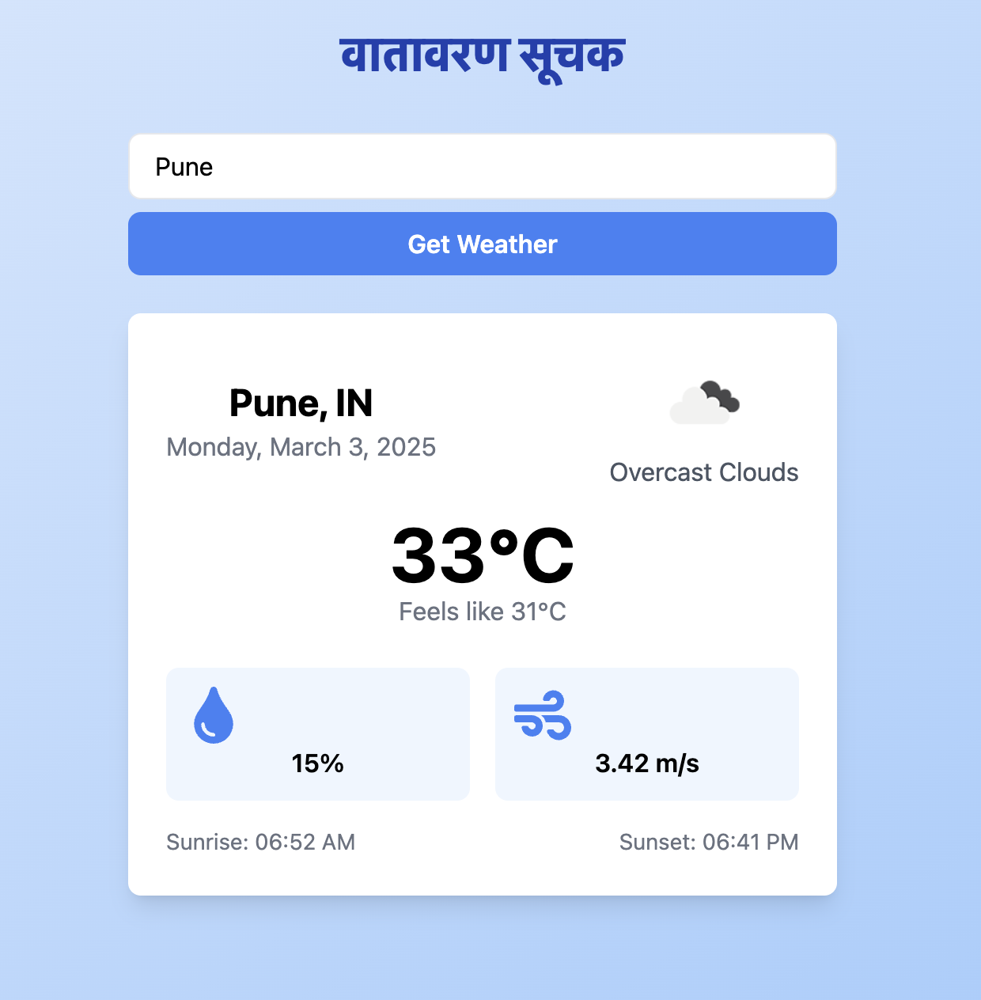

# Weather App ☀️

A modern, responsive React weather application that provides real-time weather information for any city worldwide.



## 🌐 [Live Demo](https://weather-app-woad-nu.vercel.app/)

<!-- Add your live demo link here when deployed -->

## ✨ Features

- Real-time weather data from OpenWeatherMap API
- Search weather information by city name
- Responsive design that works on desktop and mobile devices
- Displays current temperature, feels-like temperature, and weather conditions
- Additional weather details including:
  - Humidity
  - Wind speed
  - Sunrise and sunset times
- Error handling for invalid city names or API issues
- Loading states for better user experience

## 🛠️ Technologies

- React 18
- TypeScript
- TailwindCSS
- OpenWeatherMap API

## 📋 Prerequisites

Before you begin, ensure you have the following:
- Node.js (v14.0.0 or later)
- npm
- An API key from [OpenWeatherMap](https://openweathermap.org/api)

## 🚀 Installation & Setup

1. Clone the repository:
   ```bash
   git clone https://github.com/Sonam060703/weather-app.git
   cd weather-app
   ```

2. Install dependencies:
   ```bash
   npm install
   ```

3. Create a `.env` file in the root directory and add your API key:
   ```
   VITE_WEATHER_API_KEY=your_api_key_here
   ```

4. Update the API configuration in `src/config/api.ts`:
   ```typescript
   export const API_CONFIG = {
     API_KEY: import.meta.env.VITE_WEATHER_API_KEY, // Use environment variable
     BASE_URL: "https://api.openweathermap.org/data/2.5",
     UNITS: "metric",
     ICON_URL: "https://openweathermap.org/img/wn"
   };
   ```

5. Start the development server:
   ```bash
   npm run dev
   ```

6. Open [http://localhost:5173](http://localhost:5173) in your browser

## 📁 Project Structure

```
src/
├── components/
│   ├── SearchBar/
│   ├── WeatherCard/
│   ├── ErrorMessage/
│   └── LoadingSpinner/
├── types/
├── services/
├── hooks/
├── context/
├── config/
├── utils/
├── App.tsx
└── main.tsx
```

## 🔍 How It Works

1. Enter a city name in the search bar
2. The app fetches current weather data from OpenWeatherMap API
3. Weather information is displayed in a clean, easy-to-read card
4. If there's an error (e.g., city not found), an error message is shown

## 🧪 Running Tests

```bash
npm test
```

## 🚢 Deployment

To build the app for production:

```bash
npm run build
```

The build artifacts will be stored in the `dist/` directory.


## 👏 Acknowledgements

- [OpenWeatherMap](https://openweathermap.org/) for providing the weather data API
- [TailwindCSS](https://tailwindcss.com/) for the utility-first CSS framework
- [React](https://reactjs.org/) for the UI library